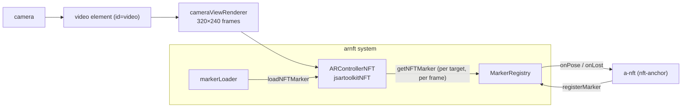

# Aframe-nft 📷

A-Frame components for markerless AR with **NFT (Natural Feature Tracking)** image targets,
powered by [jsartoolkitNFT](https://github.com/webarkit/jsartoolkitNFT).
Declare an image target with `<a-nft>`, put any A-Frame content inside it, and the content
follows the printed image in the camera view.

```html
<a-nft name="pinball" url="DataNFT/pinball">
  <a-box color="#4CC3D9"></a-box>
</a-nft>
```

> **Status:** early (0.1.x). The `<a-nft>` API is small and stable in spirit, but may still
> change before 1.0. An npm package is coming soon; until then, use the bundle from this
> repository (see [Using it in your page](#using-it-in-your-page-)).

## Contents

- [Features](#features-)
- [Quick start](#quick-start-)
- [Using it in your page](#using-it-in-your-page-)
- [Image targets](#image-targets-)
- [API reference](#api-reference-)
- [Troubleshooting](#troubleshooting-)
- [How it works](#how-it-works-)
- [Development](#development-)
- [Known limitations](#known-limitations-)
- [Credits](#credits-)
- [License](#license-)

## Features ✨

- **Declarative** — one `<a-nft>` per image target; any A-Frame entity inside it is anchored to
  the target.
- **Multiple targets at once** — every declared target is tracked independently and at the
  same time, each with its own pose.
- **Dynamic scenes** — `<a-nft>` elements can be added and removed while the scene runs.
- **Stable poses** — optional 1€ smoothing reduces jitter without adding lag while moving.
- **Correct registration** — the video and the WebGL canvas share the same box (the AR.js
  approach), so the 3D lines up with the video for any camera parameter file, with no
  per-device tweaking.

## Quick start 🚀

Requirements: [Node.js](https://nodejs.org/) and a webcam.

```bash
git clone https://github.com/webarkit/Aframe-nft.git
cd Aframe-nft
npm install
npm run dev
```

`npm run dev` opens `http://localhost:8080/examples/`, the examples index. Pick **Basic**,
allow camera access, and point the camera at the
[pinball image](https://raw.githubusercontent.com/artoolkitx/artoolkit5/master/doc/Marker%20images/pinball.jpg)
printed at 100% scale, or shown on a screen. A blue box appears on it.

To try two targets at once without printing, open **Basic** and show upstream's
[photo of both targets](https://github.com/webarkit/jsartoolkitNFT/blob/master/examples/node/pinball-demo.jpg)
on a screen.

> 📱 **On a phone**, the page must be served over **HTTPS**: browsers only expose the camera in
> a secure context (`https://` or `http://localhost`). A LAN address such as
> `http://192.168.x.x:8080` will not work.

## Using it in your page 📝

**Get the bundle.** Until the npm package is published, which is planned soon, build
`dist/AframeNft.js` with `npm run build` or copy the one committed in this repository. It is a
single script that **already contains A-Frame (1.7.1) and jsartoolkitNFT**, so do not load
A-Frame separately.

A page needs four things:

1. **The bundle.**
2. **A `<video id="video">` element.** The camera feed is drawn into it. The id must be
   `video`.
3. **An `<a-scene embedded arnft>`.** `embedded` lets the canvas be sized to match the video;
   `arnft` configures the tracker.
4. **An `<a-camera>` at the origin with `look-controls` disabled.** Poses are relative to the
   camera, so the camera itself must not move.

```html
<!DOCTYPE html>
<html lang="en">
  <head>
    <meta charset="UTF-8" />
    <meta name="viewport" content="width=device-width, initial-scale=1, maximum-scale=1" />
    <style>
      body { margin: 0; }
      /* Full-window layers. arnft sizes #video and the A-Frame canvas itself. */
      #app { position: fixed; top: 0; left: 0; width: 100%; height: 100%; }
      #video { position: absolute; top: 0; left: 0; }
      .scene-container { position: absolute; width: 100%; height: 100%; overflow: hidden; }
    </style>
    <script src="path/to/AframeNft.js"></script>
  </head>
  <body>
    <div id="app">
      <video id="video" autoplay muted playsinline></video>
    </div>

    <div class="scene-container">
      <a-scene embedded arnft="cameraParam: path/to/camera_para.dat">
        <a-nft name="pinball" url="path/to/DataNFT/pinball">
          <a-box color="#4CC3D9"></a-box>
        </a-nft>

        <a-camera position="0 0 0" look-controls="enabled: false"></a-camera>
      </a-scene>
    </div>
  </body>
</html>
```

The pages in [`examples/`](examples/) are complete and use the same layout.

Notes:
- **`url`** is the descriptor set path **without** extension: jsartoolkitNFT appends `.fset`,
  `.fset3` and `.iset`.
- **Relative paths.** Relative `url` and `cameraParam` paths resolve against the page, like
  any other asset URL.
- **`autoplay muted playsinline`** are required on the video for mobile Safari.

### Several targets

Declare one `<a-nft>` per target. They are all tracked at the same time:

```html
<a-nft name="pinball" url="DataNFT/pinball"><a-box color="#4CC3D9"></a-box></a-nft>
<a-nft name="kuva" url="DataNFT/kuva"><a-sphere color="#E4572E"></a-sphere></a-nft>
```

### Adding and removing targets at runtime

`<a-nft>` elements can be added and removed with ordinary DOM calls. The target loads when the
element is added, even while tracking is already running.

```js
const nft = document.createElement('a-nft');
nft.setAttribute('name', 'kuva');
nft.setAttribute('url', 'DataNFT/kuva');
nft.innerHTML = '<a-sphere color="#E4572E"></a-sphere>';
document.querySelector('a-scene').appendChild(nft);

// Later:
nft.remove();
```

See [`examples/dynamic.html`](examples/dynamic.html) for a working page. Two caveats:

- **Bring a target back by creating a new element.** A-Frame does not re-initialise
  components when the *same* element is appended again, so a re-appended `<a-nft>` stays
  hidden ([#15](https://github.com/webarkit/Aframe-nft/issues/15)).
- **Removed targets stay loaded.** jsartoolkitNFT cannot unload a target. Adding a new
  `<a-nft>` with the same `url` reuses the loaded one instead of loading it again.

## Image targets 🎯

An NFT target is a **descriptor set**: three files (`.fset`, `.fset3`, `.iset`) generated from
an image, plus an ARToolKit **camera parameter** file (`camera_para.dat`). The descriptor
encodes the image's real-world size, from its pixel dimensions and DPI.

**Bundled targets.** The repository ships two targets, `pinball` and `kuva`, under
[`examples/DataNFT/`](examples/DataNFT/), and a camera file at
[`examples/Data/camera_para.dat`](examples/Data/camera_para.dat).

**Your own targets.** Generate descriptors with the
[NFT Marker Creator](https://github.com/webarkit/Nft-Marker-Creator-App). Images with plenty of
detail and contrast track best; flat areas, repetitive patterns and very small images do not.

### Print your target at 100% scale

**The most common cause of a misaligned overlay is a badly printed target**, not a code or
calibration problem. The tracker solves the pose against the size encoded in the descriptor.
If the print is scaled, the pose is systematically wrong and the overlay drifts to one side.
"Fit to Page" is especially bad because it scales width and height differently.

For the bundled `pinball` target (893 × 1117 px at 120 dpi) a correct print measures:

| | expected |
|---|---|
| width | **189.0 mm** (`893 / 120 × 25.4`) |
| height | **236.4 mm** (`1117 / 120 × 25.4`) |
| aspect | **0.7995** |

Check it with a ruler. If width and height are off by *different* ratios, the print is
squashed: reprint at **100% / Actual Size**, with "Fit to Page" turned **off**.

To rule printing out entirely, show the
[source image](https://raw.githubusercontent.com/artoolkitx/artoolkit5/master/doc/Marker%20images/pinball.jpg)
on a screen at 1:1. The overlay then lands correctly, though the mesh looks oversized: the
on-screen image is smaller than the 189 mm the descriptor assumes. This was diagnosed on this
exact target in [webarkit/jsfeatNext#142](https://github.com/webarkit/jsfeatNext/issues/142).

## API reference 📖

### `arnft` system — set on `<a-scene>`

| Attribute | Type | Default | Description |
|-----------|------|---------|-------------|
| `cameraParam` | string | `Data/camera_para.dat` | ARToolKit camera parameter file, relative to the page |
| `videoWidth` | number | `640` | Requested capture width (an ideal, not a guarantee) |
| `videoHeight` | number | `480` | Requested capture height (an ideal, not a guarantee) |
| `lostTimeout` | number | `200` | How long (ms) a target may go unseen before its content is hidden |
| `continuousDetection` | boolean | `true` | Keep looking for untracked targets while others are tracked. `false` is cheapest, but a second target entering the view is then not found |
| `detectionInterval` | number | `300` | Minimum time (ms) between searches for untracked targets while others are tracked; `0` searches every frame |

`continuousDetection` and `detectionInterval` are read once, when tracking starts
([#13](https://github.com/webarkit/Aframe-nft/issues/13)).

### `<a-nft>` primitive — the `nft-anchor` component

`<a-nft>` is an A-Frame entity with the `nft-anchor` component. Its children are the content
anchored to the target.

| Attribute | Component property | Type | Default | Description |
|-----------|--------------------|------|---------|-------------|
| `url` | `markerUrl` | string | `DataNFT/pinball` | Descriptor set, without extension. Always set it: the default only suits the bundled example |
| `name` | `entityName` | string | `pinball` | Label used in console messages |

The remaining properties are set through the component, for example
`<a-nft nft-anchor="scaleFactor: 100; smooth: false" …>`:

| Property | Type | Default | Description |
|----------|------|---------|-------------|
| `scaleFactor` | number | `150` | Uniform scale for the content. Pose units are millimetres, so a 1-unit primitive would be 1 mm |
| `lift` | boolean | `true` | Lift the content so it rests **on** the target. `false` centres it on the target plane |
| `offsetX` | number | `0` | Extra X offset in target millimetres (rarely needed) |
| `offsetY` | number | `0` | Extra Y offset in target millimetres (rarely needed) |
| `smooth` | boolean | `true` | 1€ pose smoothing (reduces jitter) |
| `smoothMinCutoff` | number | `0.0001` | Smoothing at rest: lower is smoother but lags more |
| `smoothBeta` | number | `0.01` | Speed response: higher lags less while moving |

The content is centred on the target automatically, using the target's real-world size.

## Troubleshooting 🩺

**`arnft: camera init failed` in the console**

| Error | What it means |
|---|---|
| `NotAllowedError` | Camera permission was denied, or the page is not in a secure context (see the HTTPS note above). |
| `NotReadableError` | The camera could not start, usually because another application is using it. Virtual cameras that cannot start (for example those installed by Meta Quest Link) are skipped automatically. |
| a `TypeError` mentioning `srcObject` | The page has no `<video id="video">` element. |

**`arnft: failed to load NFT marker "…"`.** The descriptor set could not be loaded:
- check that `url` has **no** extension and that the path resolves relative to the page (the
  Network tab shows the 404s);
- a page can hold at most 20 targets.

**The target is not detected.**
- Use good, even lighting.
- Let the target fill a reasonable part of the view.
- Avoid glare on glossy prints.
- Make sure the target is the image the descriptors were made from.

**The content is shifted or drifts to one side.** Check the print scale first; see
[Print your target at 100% scale](#print-your-target-at-100-scale). A tall object
standing on the target shows real perspective parallax at steep angles; `lift: false` centres
it on the plane instead.

**The content is tiny or huge.** Adjust `scaleFactor`: pose units are millimetres.

## How it works 🔍



1. **Camera.** The `arnft` system opens the camera, preferring the rear camera on phones.
   `cameraViewRenderer` draws each frame into a 320×240 processing canvas, letterboxing
   non-4:3 video.
2. **Tracker.** Once the camera is live and at least one `<a-nft>` exists, the system creates
   a single `ARControllerNFT` and applies its projection to the A-Frame camera. There is one
   tracker per scene, not one per target.
3. **Targets.** Each `<a-nft>` registers with the system. `markerLoader` loads its descriptor
   set with one call per target, so a bad `url` only affects its own `<a-nft>`.
   `MarkerRegistry` tracks load state, visibility and reusable ids.
4. **Each frame.** `process()` detects and tracks every loaded target. Each pose is routed to
   its `nft-anchor`, which:
   - smooths the pose (1€ filter);
   - centres the content using the target's real size (DPI → mm);
   - scales and lifts it.

   A target not seen for `lostTimeout` ms is hidden.
5. **Alignment.** The video and the WebGL canvas are sized to the same "cover" box, so the
   projection maps 3D onto exactly the video's pixels.

| Module | Responsibility |
|--------|----------------|
| [`src/index.js`](src/index.js) | Entry point: importing it registers everything |
| [`src/registerNFT.js`](src/registerNFT.js) | A-Frame glue: the `arnft` system, the `nft-anchor` component, the `<a-nft>` primitive |
| [`src/cameraViewRenderer.js`](src/cameraViewRenderer.js) | Camera stream and processing frames |
| [`src/markerRegistry.js`](src/markerRegistry.js) | Target bookkeeping: load state, visibility, reusable ids |
| [`src/markerLoader.js`](src/markerLoader.js) | Loads descriptor sets into the tracker |
| [`src/nftMath.js`](src/nftMath.js) | Pose geometry: centring, lift, matrix normalisation |
| [`src/poseFilter.js`](src/poseFilter.js) | 1€ pose smoothing, on top of [`@webarkit/oneeurofilter-ts`](https://github.com/webarkit/OneEuroFilter-ts) |

Design history and the reasons behind these choices are in [DESIGN.md](DESIGN.md).

## Development 🔧

| Command | What it does |
|---------|--------------|
| `npm run dev` | Vite dev server with HMR; opens the examples index |
| `npm test` | Unit tests (Vitest + jsdom) |
| `npm run build` | Builds the IIFE bundle `dist/AframeNft.js` |
| `npm run preview` | Serves a production build |

Conventions:
- **Tests.** Logic lives in DOM-free modules with a Vitest suite under `test/`. The A-Frame
  glue in `registerNFT.js` is verified with the examples on a real camera.
- **Bundle.** `dist/AframeNft.js` is committed. Rebuild it with `npm run build` when a change
  touches `src/`.
- **Commits** follow the [Conventional Commits](https://www.conventionalcommits.org/) style
  (`feat:`, `fix:`, `docs:` …).
- **Examples.** Add new ones to [`examples/index.html`](examples/index.html). Keep that index
  in `examples/`: a root `index.html` would become Vite's fallback page for every missing
  file, turning a mistyped marker url's 404 into a 200.

Bug reports and pull requests are welcome in the
[issue tracker](https://github.com/webarkit/Aframe-nft/issues).

## Known limitations 🚧

- **At most 20 targets per page.** jsartoolkitNFT holds at most 20 targets and cannot unload
  one.
- **Main-thread detection.** Detection runs on the main thread. Moving it off the main thread
  is tracked in [#7](https://github.com/webarkit/Aframe-nft/issues/7).
- **Runtime adds stall briefly.** Adding an `<a-nft>` at runtime briefly stalls the main thread
  while its target loads ([#14](https://github.com/webarkit/Aframe-nft/issues/14)).
- **Runtime `url` changes are ignored.** Changing `url` on an existing `<a-nft>` has no effect;
  replace the element instead ([#15](https://github.com/webarkit/Aframe-nft/issues/15)).

See the [open issues](https://github.com/webarkit/Aframe-nft/issues) for the full list.

## Credits 🙏

- [jsartoolkitNFT](https://github.com/webarkit/jsartoolkitNFT) (WebARKit): NFT detection and
  tracking.
- [A-Frame](https://aframe.io/): the WebXR framework this builds on.
- [AR.js](https://github.com/AR-js-org/AR.js): the video/canvas alignment approach.
- The [1€ filter](https://gery.casiez.net/1euro/) (Casiez, Roussel and Vogel, CHI 2012), via
  WebARKit's [OneEuroFilter-ts](https://github.com/webarkit/OneEuroFilter-ts): pose smoothing.

## License 📄

[LGPL-3.0-or-later](LICENSE). The LGPL builds on the GNU GPL, whose text is in
[COPYING](COPYING).
